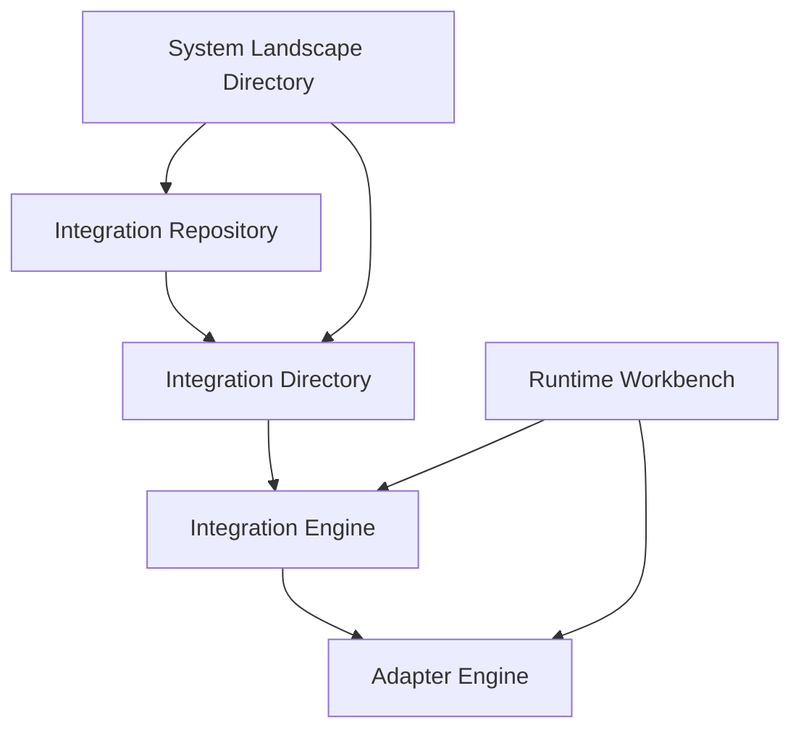

# Getting Started with SAP PI/PO

SAP Process Integration (PI) and its successor Process Orchestration (PO) form the backbone of enterprise integration for many SAP landscapes. This guide will help you understand the fundamentals and get started with your first integration scenario.

## Architecture Overview

### Core Components



**Integration Repository (IR)**
- Design-time environment
- Message interfaces and mappings
- Reusable integration objects

**Integration Directory (ID)**  
- Configuration environment
- Routing and mapping assignments
- Technical system configurations

**Integration Engine (IE)**
- Central processing hub
- Message routing and transformation
- Quality of service handling

**Adapter Engine (AE)**
- Protocol and format conversion
- Connectivity to external systems
- Message packaging and delivery

## Development Lifecycle

### Phase 1: Analysis and Design
1. **Business Requirements** - Understand integration needs
2. **System Analysis** - Identify source and target systems
3. **Data Mapping** - Define transformation requirements
4. **Interface Design** - Create message structures

### Phase 2: Development
1. **Repository Objects** - Create data types and message interfaces
2. **Mapping Development** - Build transformation logic
3. **Configuration** - Set up communication channels and party agreements
4. **Testing** - Validate with test data

### Phase 3: Deployment and Operations
1. **Transport** - Move objects to production
2. **Monitoring Setup** - Configure alerts and dashboards
3. **Go-Live Support** - Monitor initial operations
4. **Optimization** - Fine-tune performance

## Your First Integration Scenario

Let's build a simple file-to-file integration to understand the basics.

### Scenario: Customer Data Sync
**Requirement:** Transfer customer data from System A (CSV) to System B (XML)

### Step 1: Create Data Types

**Source Structure (DT_Customer_CSV)**
```xml
<xs:schema xmlns:xs="http://www.w3.org/2001/XMLSchema">
  <xs:element name="CustomerCSV">
    <xs:complexType>
      <xs:sequence>
        <xs:element name="ID" type="xs:string"/>
        <xs:element name="Name" type="xs:string"/>
        <xs:element name="Email" type="xs:string"/>
        <xs:element name="Status" type="xs:string"/>
      </xs:sequence>
    </xs:complexType>
  </xs:element>
</xs:schema>
```

**Target Structure (DT_Customer_XML)**
```xml
<xs:schema xmlns:xs="http://www.w3.org/2001/XMLSchema">
  <xs:element name="Customer">
    <xs:complexType>
      <xs:sequence>
        <xs:element name="CustomerID" type="xs:string"/>
        <xs:element name="FullName" type="xs:string"/>
        <xs:element name="EmailAddress" type="xs:string"/>
        <xs:element name="IsActive" type="xs:boolean"/>
      </xs:sequence>
    </xs:complexType>
  </xs:element>
</xs:schema>
```

### Step 2: Create Message Interfaces

**Outbound Interface (MI_Customer_Out)**
- Mode: Asynchronous
- Data Type: DT_Customer_CSV

**Inbound Interface (MI_Customer_In)**  
- Mode: Asynchronous
- Data Type: DT_Customer_XML

### Step 3: Create Message Mapping

**Mapping Logic (MM_Customer_CSV_to_XML)**
```xsl
<xsl:template match="/">
  <Customer>
    <CustomerID><xsl:value-of select="CustomerCSV/ID"/></CustomerID>
    <FullName><xsl:value-of select="CustomerCSV/Name"/></FullName>
    <EmailAddress><xsl:value-of select="CustomerCSV/Email"/></EmailAddress>
    <IsActive>
      <xsl:choose>
        <xsl:when test="CustomerCSV/Status = 'ACTIVE'">true</xsl:when>
        <xsl:otherwise>false</xsl:otherwise>
      </xsl:choose>
    </IsActive>
  </Customer>
</xsl:template>
```

### Step 4: Configuration in Integration Directory

**Business System Configuration**
1. Create business systems for source and target
2. Assign communication channels
3. Configure adapter parameters

**Communication Channels**
```yaml
Sender Channel:
  Type: "File Adapter"
  Transport Protocol: "File System (NFS)"
  Source Directory: "/input/customers"
  File Name Scheme: "customer_*.csv"
  Processing Mode: "Delete"

Receiver Channel:
  Type: "File Adapter"  
  Transport Protocol: "File System (NFS)"
  Target Directory: "/output/customers"
  File Name Scheme: "customer_%counter%.xml"
  File Construction Mode: "Create"
```

**Integration Flow Configuration**
1. Create receiver determination
2. Create interface determination  
3. Create receiver agreement
4. Create sender agreement

## Essential Tools and Utilities

### Development Tools
- **Enterprise Services Builder** - Repository development
- **Integration Builder** - Configuration and directory
- **ABAP Workbench** - Custom adapter development
- **Java Development** - Custom mapping and modules

### Monitoring Tools
- **Runtime Workbench (RWB)** - Central monitoring
- **Message Monitoring** - End-to-end tracking
- **Adapter Monitoring** - Channel status
- **Performance Monitoring** - System health

### Useful Transaction Codes
| Transaction | Description |
|-------------|-------------|
| **SXMB_MONI** | Message monitoring |
| **SXMB_ADM** | Integration engine admin |
| **IDX1/IDX2** | Inbound/Outbound processing |
| **SLD** | System landscape directory |
| **SICF** | HTTP service maintenance |

## Testing Your Integration

### Unit Testing
1. **Test mapping** with sample data in ESB
2. **Validate message structure** against XSD
3. **Check transformation logic** with edge cases

### Integration Testing
```bash
# Place test file in source directory
echo "123,John Doe,john@example.com,ACTIVE" > /input/customers/customer_test.csv

# Monitor processing in RWB
# Check output in target directory
ls -la /output/customers/

# Verify content
cat /output/customers/customer_001.xml
```

### Error Scenarios
Test these common failure cases:
- Invalid file format
- Network connectivity issues
- Target system unavailability  
- Mapping errors with malformed data

## Performance Considerations

### Message Processing
- **Batch size** - Configure optimal processing volumes
- **Queue management** - Monitor and tune queue depths
- **Memory usage** - Optimize for large message processing
- **Connection pooling** - Efficient resource utilization

### Monitoring Setup
```sql
-- Monitor message throughput
SELECT 
    TO_CHAR(START_TIME, 'HH24') as HOUR,
    COUNT(*) as MESSAGE_COUNT,
    AVG(PROCESSING_TIME) as AVG_TIME
FROM XI_MESSAGE_LOG 
WHERE START_TIME > SYSDATE - 1
GROUP BY TO_CHAR(START_TIME, 'HH24')
ORDER BY HOUR;
```

## Common Pitfalls and Solutions

### Issue 1: Repository Cache Problems
**Symptoms:** Old versions of objects being used
**Solution:** Clear cache in SXI_CACHE transaction

### Issue 2: Mapping Failures  
**Symptoms:** Transformation errors in message monitoring
**Solution:** Test mappings thoroughly in ESB, add debug output

### Issue 3: Adapter Connectivity
**Symptoms:** Channel errors in adapter monitoring
**Solution:** Verify network connectivity, check credentials

## Next Steps

Once you've mastered the basics:

1. **Explore advanced mappings** - Java mappings, ABAP mappings
2. **Learn adapter configurations** - Database, SAP adapters  
3. **Understand error handling** - Alert configuration, retry logic
4. **Performance optimization** - Tuning and monitoring
5. **Migration planning** - Prepare for Integration Suite

---

*Ready for more advanced topics? Continue with [Advanced Configurations](advanced-configurations.md) or jump to specific areas based on your project needs.*
