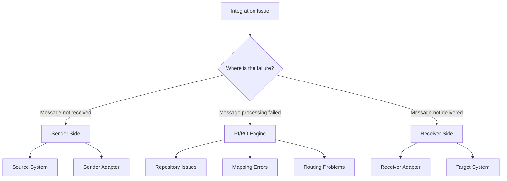

# PI/PO Troubleshooting Guide

A comprehensive reference for diagnosing and resolving common SAP PI/PO issues. This guide is organized by symptom and provides systematic approaches to problem resolution.

## Diagnostic Approach

### 1. Identify the Problem Layer


### 2. Gather Information
Essential data points for troubleshooting:
- **Message ID** - Unique identifier for tracking
- **Interface Name** - Integration scenario
- **Timestamp** - When the issue occurred
- **Error Message** - Exact error text
- **Business Context** - What was being processed

## Common Issues and Solutions

### Message Processing Failures

#### Issue: Messages Stuck in Queue
**Symptoms:**
- Messages remain in "Processing" status
- Queue depth increasing continuously
- No error messages visible

**Diagnostic Steps:**
```sql
-- Check queue status
SELECT 
    QUEUE_NAME,
    QUEUE_DEPTH,
    CONSUMERS_ACTIVE,
    LAST_PROCESSED
FROM XI_QUEUE_STATUS 
WHERE QUEUE_DEPTH > 0;

-- Check processing threads
SELECT 
    THREAD_ID,
    STATUS,
    CURRENT_MESSAGE,
    START_TIME
FROM XI_PROCESSING_THREADS;
```

**Common Causes & Solutions:**

1. **Dead Lock in Processing**
   ```bash
   # Restart messaging service
   /usr/sap/XI/J00/j2ee/cluster/server0/bin/stopmessaging.sh
   /usr/sap/XI/J00/j2ee/cluster/server0/bin/startmessaging.sh
   ```

2. **Database Connection Issues**
   ```sql
   -- Check connection pool
   SELECT 
       POOL_NAME,
       ACTIVE_CONNECTIONS,
       IDLE_CONNECTIONS,
       MAX_CONNECTIONS
   FROM XI_CONNECTION_POOLS;
   ```

3. **Memory Issues**
   ```bash
   # Check JVM memory usage
   jstat -gc <java_process_id>
   
   # Increase heap size if needed
   -Xmx8192m -Xms4096m
   ```

#### Issue: Mapping Failures
**Symptoms:**
- Messages fail during transformation
- "Mapping error" in message monitoring
- Specific field transformation issues

**Diagnostic Approach:**
```java
// Debug mapping with test data
public void debugMapping(String testXML) {
    try {
        // Load test payload
        Document testDoc = loadXMLDocument(testXML);
        
        // Apply mapping
        Document result = executeMapping(testDoc);
        
        // Validate result
        validateOutput(result);
        
    } catch (Exception e) {
        System.out.println("Mapping failed: " + e.getMessage());
        e.printStackTrace();
    }
}
```

**Common Mapping Issues:**

1. **Null Pointer Exceptions**
   ```xml
   <!-- Add null checks -->
   <xsl:if test="CustomerData/Name">
     <CustomerName>
       <xsl:value-of select="CustomerData/Name"/>
     </CustomerName>
   </xsl:if>
   ```

2. **Data Type Mismatches**
   ```xml
   <!-- Convert data types properly -->
   <Amount>
     <xsl:value-of select="format-number(Price, '0.00')"/>
   </Amount>
   ```

3. **Namespace Issues**
   ```xml
   <!-- Declare namespaces correctly -->
   <xsl:stylesheet version="1.0" 
                   xmlns:xsl="http://www.w3.org/1999/XSL/Transform"
                   xmlns:source="http://company.com/source"
                   xmlns:target="http://company.com/target">
   ```

### Adapter Issues

#### File Adapter Problems
**Issue: Files Not Being Picked Up**

**Checklist:**
- [ ] Directory permissions (read/write access)
- [ ] File naming pattern matches configuration
- [ ] File locking by other processes
- [ ] NFS mount issues (if applicable)

```bash
# Check directory permissions
ls -la /interface/input/

# Test file creation
touch /interface/input/test_file.txt
rm /interface/input/test_file.txt

# Check file locks
lsof | grep /interface/input/
```

**Issue: Files Created But Empty**
```java
// Common file adapter configuration
<FileAdapter>
    <SourceDirectory>/interface/input</SourceDirectory>
    <FileName>*.xml</FileName>
    <ProcessingMode>Delete</ProcessingMode>
    <PollingInterval>60</PollingInterval>
    <FileConstructionMode>Create</FileConstructionMode>
    <FileNameScheme>output_%counter%.xml</FileNameScheme>
</FileAdapter>
```

#### RFC Adapter Issues
**Issue: RFC Connection Failures**

**Diagnostic Commands:**
```abap
* Test RFC connection in SM59
* Check RFC authorizations in SU53
* Verify RFC function module exists in SE37

" Test RFC call
DATA: lv_customer TYPE string.
CALL FUNCTION 'BAPI_CUSTOMER_GETDETAIL'
  DESTINATION 'PI_SYSTEM'
  EXPORTING
    customerno = '12345'
  IMPORTING
    customer_address = lv_customer
  EXCEPTIONS
    system_failure = 1
    communication_failure = 2.

IF sy-subrc <> 0.
  WRITE: 'RFC call failed:', sy-subrc.
ENDIF.
```

**Common Solutions:**
1. **Authorization Issues** - Check RFC user permissions
2. **Network Connectivity** - Verify firewall rules
3. **Load Balancing** - Configure RFC groups properly

### Performance Issues

#### Slow Message Processing
**Performance Analysis Query:**
```sql
-- Identify slow interfaces
SELECT 
    INTERFACE_NAME,
    COUNT(*) as MESSAGE_COUNT,
    AVG(PROCESSING_TIME) as AVG_TIME,
    MAX(PROCESSING_TIME) as MAX_TIME,
    MIN(PROCESSING_TIME) as MIN_TIME
FROM XI_MESSAGE_LOG 
WHERE START_TIME > SYSDATE - 1
GROUP BY INTERFACE_NAME
HAVING AVG(PROCESSING_TIME) > 10000  -- More than 10 seconds
ORDER BY AVG_TIME DESC;
```

**Optimization Techniques:**

1. **Database Tuning**
   ```sql
   -- Add indexes for frequently queried columns
   CREATE INDEX IDX_MSG_INTERFACE_TIME 
   ON XI_MESSAGE_LOG (INTERFACE_NAME, START_TIME);
   
   -- Update statistics
   EXEC sp_updatestats;
   ```

2. **JVM Optimization**
   ```bash
   # Garbage collection tuning
   -XX:+UseG1GC
   -XX:MaxGCPauseMillis=200
   -XX:G1HeapRegionSize=16m
   
   # Memory settings
   -Xms4g -Xmx8g
   ```

3. **Message Processing**
   ```java
   // Batch processing for high volume
   public void processBatch(List<Message> messages) {
       int batchSize = 100;
       for (int i = 0; i < messages.size(); i += batchSize) {
           List<Message> batch = messages.subList(i, 
               Math.min(i + batchSize, messages.size()));
           processBatchMessages(batch);
       }
   }
   ```

### Repository and Cache Issues

#### Cache Synchronization Problems
**Symptoms:**
- Old versions of objects being used
- Configuration changes not taking effect
- Inconsistent behavior across systems

**Resolution Steps:**
```bash
# Clear repository cache
Transaction: SXI_CACHE
- Select "Clear Cache"
- Choose "Complete Cache"

# Restart Java engine
/usr/sap/XI/J00/j2ee/cluster/server0/bin/restart.sh

# Check cache status
Transaction: SXMB_ADM
- Integration Engine Configuration
- Check Repository Cache Status
```

#### Transport Issues
**Issue: Objects Not Transported Properly**

**Checklist:**
- [ ] All dependent objects included in transport
- [ ] Transport order correct (Repository before Directory)
- [ ] Target system configuration matches source
- [ ] Cache cleared after transport

```abap
* Check transport status
SELECT * FROM E070 
WHERE TRKORR = 'XI1K900123'
AND AS4PROG = 'OBJECTS_CHANGED'.

* Verify object consistency
Transaction: SXMB_ADM
- Integration Engine Configuration
- Check Object Consistency
```

### Monitoring and Alerting

#### Setting Up Proactive Monitoring
```sql
-- Create monitoring views
CREATE VIEW V_XI_ERROR_SUMMARY AS
SELECT 
    DATE(START_TIME) as ERROR_DATE,
    INTERFACE_NAME,
    ERROR_CODE,
    COUNT(*) as ERROR_COUNT
FROM XI_MESSAGE_LOG 
WHERE STATUS = 'ERROR'
GROUP BY DATE(START_TIME), INTERFACE_NAME, ERROR_CODE;

-- Daily error report
SELECT * FROM V_XI_ERROR_SUMMARY 
WHERE ERROR_DATE = CURRENT_DATE
ORDER BY ERROR_COUNT DESC;
```

#### Alert Configuration
```yaml
# Alert rules configuration
monitoring:
  alerts:
    - name: "Message Processing Failure"
      condition: "error_count > 10 in 5min"
      severity: "critical"
      notification:
        - email: "integration-team@company.com"
        - sms: "+1234567890"
    
    - name: "Queue Depth Warning"
      condition: "queue_depth > 1000"
      severity: "warning"
      notification:
        - email: "ops-team@company.com"
    
    - name: "Performance Degradation"
      condition: "avg_processing_time > 30s in 10min"
      severity: "warning"
      notification:
        - slack: "#performance-alerts"
```

## Emergency Response Procedures

### Critical System Failure
**Immediate Actions:**
1. **Assess Impact** - Which interfaces are affected?
2. **Communicate** - Notify stakeholders immediately
3. **Isolate** - Stop processing if data corruption risk
4. **Investigate** - Follow systematic diagnostic approach

### Message Recovery
```sql
-- Find failed messages
SELECT MESSAGE_ID, INTERFACE_NAME, ERROR_MESSAGE 
FROM XI_MESSAGE_LOG 
WHERE STATUS = 'ERROR' 
AND START_TIME > SYSDATE - 1;

-- Restart specific messages
UPDATE XI_MESSAGE_LOG 
SET STATUS = 'RETRY', RETRY_COUNT = 0 
WHERE MESSAGE_ID = 'specific_message_id';
```

### Rollback Procedures
```bash
# Rollback transport if needed
tp rollback XI1K900123 XI1 client=100

# Restore from backup
# Stop XI services
# Restore database/filesystem
# Restart services
# Verify functionality
```

## Best Practices for Prevention

### Regular Maintenance
- **Weekly:** Review error logs and performance metrics
- **Monthly:** Archive old messages and clear logs
- **Quarterly:** Review and update monitoring thresholds
- **Annually:** Perform capacity planning and system health checks

### Documentation Standards
- **Runbooks** for common issues
- **Interface documentation** with troubleshooting steps
- **Contact lists** for escalation
- **Change procedures** with rollback plans

---

*Keep this guide handy for quick reference during incidents. For complex issues, don't hesitate to engage SAP support with the diagnostic information you've gathered.*
